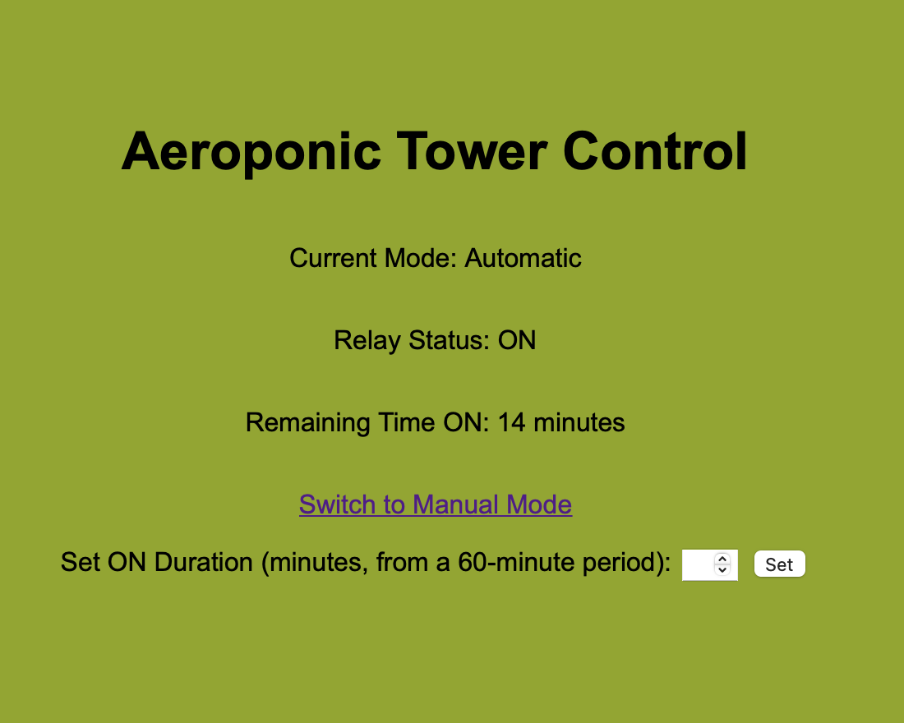

# Aeroponic Tower Control

This is a simple control system for an aeroponic tower to control the pump that is distributing nutrients to the plants.

## Hardware used

- ESP01 with relay module (ESP8266)
- FTDI converter (used to program the ESP01)
- 5V 2A power supply to power up the ESP from 220V

## Programming the ESP01

The following connection has to be made between the ESP01 and the FTDI converter:

| ESP01 | FTDI |
|-------|------|
| TX    | RX   |
| RX    | TX   |
| VCC   | VCC  |
| GND   | GND  |
| CH_EN | VCC  |
| GPIO0 | GND  |

## How it works

The control system has automatic and manual mode. The control panel is accessible via a WiFi access point called "Aeroponic Tower Control", password: "hyperveggies". You have to manually go to IP `192.168.4.1` to access the control panel.

### Automatic mode

The control system will turn on the relay for a specified period of time (default is 15 minutes) during the period of 1 hour.

### Manual mode

In manual mode, the control system will allow the capability to toggle the relay.

## Further development

1. Implement structs for the relay control
2. Be able to save the configuration on the EEPROM
3. Detailed documentation
